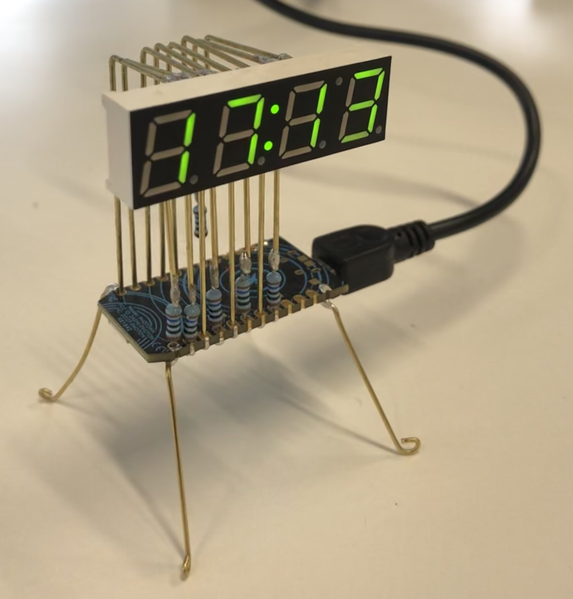
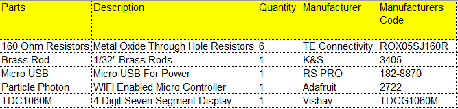
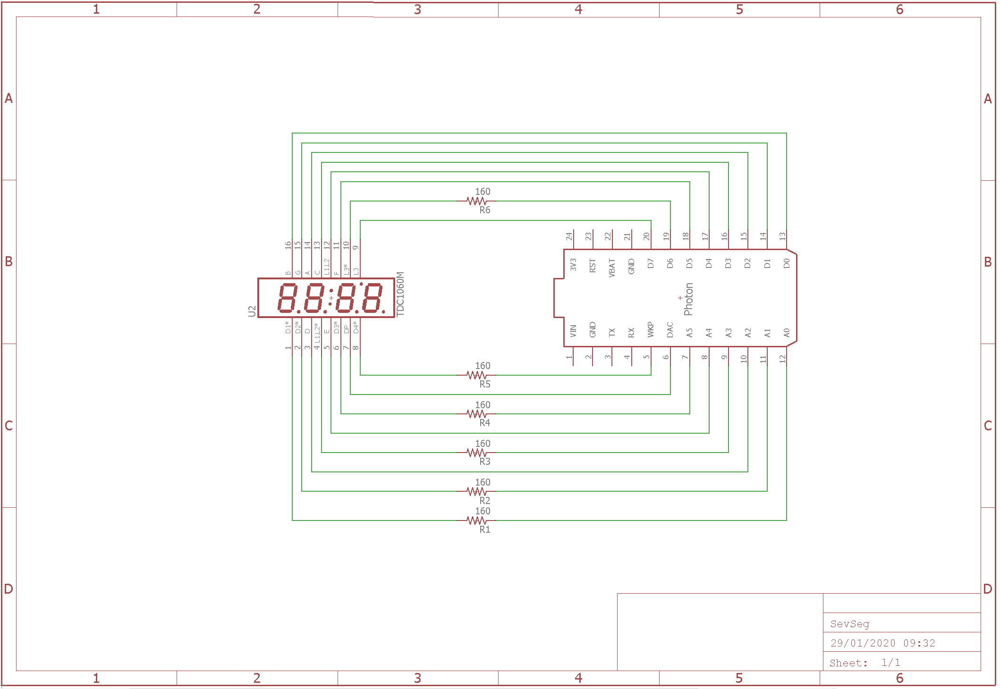
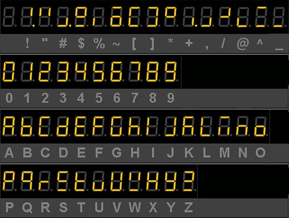

# Seven Segment Clock
This project combines a Particle Photon, and a seven-segment display to make a cute little clock.

// 

### Notes
This project is inspired by the SevSeg made by Mohit Bhoite. The original can be found [Here](https://www.bhoite.com/2015/08/sevenseg/).
This project also uses a modified version of of the SevSeg library made by [Dean Reading](https://github.com/DeanIsMe/SevSeg).

## Getting Started
### Prerequisites
All the Components that are need can be found in the bellow list:
 

One needs to have the Particle Photon initialised and setup to their Wi-Fi and account. Following the guide at the [Particle Website](https://docs.particle.io/quickstart/photon/).

Next, if you're using the Web IDE click on this [Link](https://go.particle.io/shared_apps/5eea255f6c2eea000c4453d3). It should open your Web IDE with all the necessary files needed. (NEW Code With EEPROM To Save Previous Setting can be found at [Link](https://go.particle.io/shared_apps/5fb3edfee6f0b000092bdffb))
If you're using the Atom computer application, you can find the necessary files needed under the [SevenSegClock_V3 Zip](https://github.com/saifsabban/SevenSegmentClock/tree/master/SevenSegClock_V3).

Upload the Code to your Particle Photon, and connect the photon to the Seven Segment display as shown in the schematic.

Preferably, you'd first connect everything via a breadboard and ensure everything is working.

Lastly, when everything is running as intended, solder the brass rods and resistors to the Particle Photon. This can be done in your way, be creative if you want.

## Personalising The Clock
There are 2 ways to personalise the clock, first is by going into the code and making your face animation and the next is by setting the clock to show your preferred method of displaying the time.

### Face Animations
To make your faces, you'll first need to refer to the character sheet, it shows all the accepted text characters & how they present themselves on the Seven Segment display.

 

Next, you'll need to go the _FaceFunctions.h_ file and under **FaceEmoteArray[]** add a new array with up to 31 faces. If you want to add more faces just update the number 31 in **FaceEmoteArray[][31]** to the amount of faces you'll be using.
Afterwards, you need to add another array with the time durations of each face in milliseconds. The sum of all the time durations needs to be devisable by 10000. This is due to the total duration of the faces being 10 seconds, if the faces are less than 10 seconds long then they will repeat.
When you're done with that, you'll need to add **_"const int FaceSizeX = sizeof(FaceEmoteTimeArray[X]) / sizeof(FaceEmoteTimeArray[X][0]);"_** for every face array you've add. The X should be replaced by a number that signifies the next iteration, so if you add one array that number should be 6, if you add another array the next code would have the number 7, ext.
Lastly, do the same type of iteration to the **FaceSizeArray[]**, by adding the **_"FaceSizeX"_**.

That's all you have to do, now upload your code and you're done, all you need to do is wait. Use the Particle function **"FaceReveal"** to show all the faces. (Check **_Clock Alterations_**)

### Clock Alterations
Using your phone app or going on the **Console** in the [Web IDE](https://console.particle.io/devices). Choose your device and in the **Functione** bar you should see 6 particle functions.

**_DST Show 1_**: Adds an hour for daylights savings (This should automatically add or remove daylights savings per your area. However, I haven't tested it that far). To have daylight savings mode on, type in 1, otherwise type in 0

**_FaceReveal_**: Choose a face sequence to show on the display. The default faces are between 0 & 5. If you haven't added any faces, then 6 will show the date. If any additional faces are added then the date will be the final value that you can input.

**_HourFormat 24 0_**: Choose if you want the clock to be in 24-hour mode or 12-hour mode. For 24 hour mode, type 0. Otherwise for 12-hour mode, type 1.

**_Restart 0_**: Restarts the Particle Photon when you type in 0.

**_ShowPM 1_**: If you're using the 12-hour mode, then you can have the far-right decimal point indicate if the time is PM or AM. To have this indicate working, type in 1, otherwise to hide it type 0.

**_TimeZone_**: This should be self-explanatory. Type in the desired time zone offset. The allowable limits are between -14 and 12. You can even offset by minutes, for those unusual time zones such as The Chatham Islands, or India.
